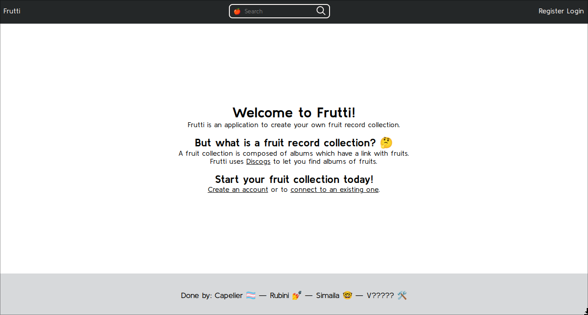
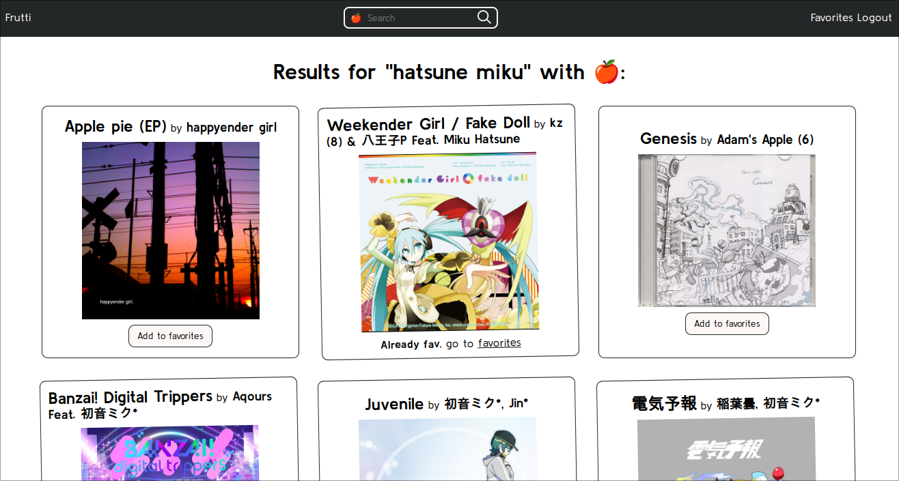
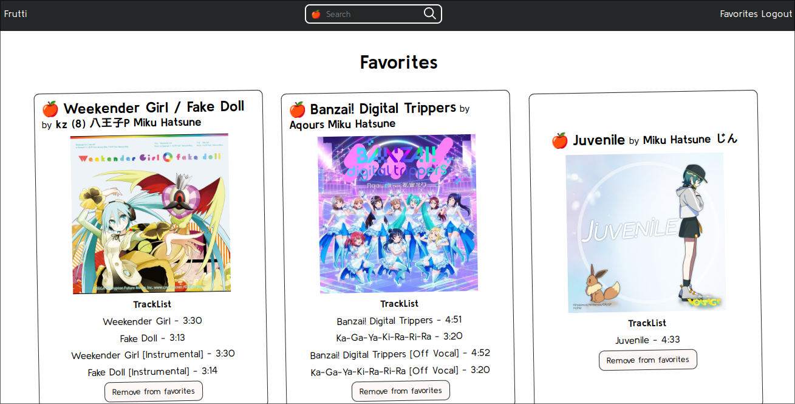

# Tutti Frutti

Tutti Frutti is a fruit based disk library.

### Search your most favorite artist and discover the fruits behind

### Keep track of your favorite disks

How to setup project:

- Add database credentials and discog key and secret in `.env.local`
- Check requirements: `symfony check:requirements`
- Install dependencies: `composer install`
- Create DB: `php bin/console doctrine:database:create`
- Create tables (?): `php bin/console doctrine:migrations:migrate`
